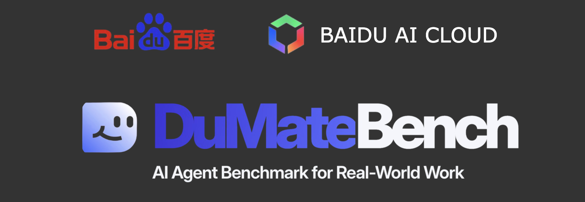

# DuMateBench



DuMateBench evaluates agents on real-world productivity and office-work tasks.
Each task gives an agent a sandboxed workspace and tools. The agent must create
the requested artifact; a task-specific evaluator then checks the artifact and
records a reward.

This repository contains the benchmark runner, evaluators, the `dumate` CLI,
development tasks, and Harbor integration. The complete public dataset is
distributed separately on Hugging Face:

<https://huggingface.co/datasets/Annihi/dumate_bench>

## What Is Being Evaluated

There are two layers in a model run:

```text
Harbor or dumate runner
  -> agent harness
      -> model API
  -> commands in the task container
  -> task evaluator
  -> reward.json
```

The harness is the program that turns model responses into tool/command
actions. For Harbor, `--agent openhands-sdk` is a harness and
`--model openai/claude-opus-4-8` is a model identifier. A model name alone is
not an agent: the harness, API endpoint, task container, and evaluator are all
part of the run.

The deterministic smoke test uses a fixed local agent and does not measure
model quality. A model score is meaningful only when the agent reaches the
evaluator and produces a `reward.json`.

## Repository Layout

```text
dumatebench/                 Runner, evaluators, agents, and dev tasks
dumatebench_cli/             dumate CLI and Harbor exporter
dumatebench/datasets/dev/    Development tasks, including template_task
dumatebench/scripts/         Smoke and batch scripts
leaderboard/                 Submission validation and CI
```

The checked-in dataset is for development and smoke testing. It includes
`template_task` and a small number of development tasks; the complete 200-task
dataset is downloaded separately in [C. Download the Public Dataset](#c-download-the-public-dataset).
The legacy `dumatebench_old/` directory, when present in a workspace, is not the
recommended runner entry point.

Before runtime preparation, a source task normally contains:

```text
task.yaml
instruction.md
environment/
evaluator/
workspace_seed/
```

The public `final_dataset_clean` tasks intentionally omit `environment/`.
They must be filled from the checked-in `template_task` before they can be
run or exported to Harbor. During this fill step, `workspace_seed/` is moved
under `environment/workspace_seed/` to make the Docker build context
self-contained.

Every runnable task must set `environment.allow_internet` explicitly to the
YAML boolean `true` or `false`. Quoted values such as `"false"` are rejected;
they are strings rather than booleans and must not silently enable a public
network.

## Install

This project is currently released and supported as a source checkout, not as
a self-contained PyPI or wheel package. Keep the `dumatebench/` and
`dumatebench_cli/` directories together and install the CLI in editable mode
from the repository root. The shared evaluator used by local runs and Harbor
exports lives in `dumatebench/evaluator/evaluate.py` next to the CLI source.
Do not install a standalone wheel or use `pip install .` for the CLI; those
artifacts do not include that shared evaluator.

Requirements:

- Python 3.10 or newer (Python 3.12 or 3.13 is recommended)
- Docker Desktop with `docker compose` v2
- Network access to PyPI and Docker Hub for the first build

Keep Docker Desktop/the Docker daemon running while you build or run tasks. If
you will run the full dataset or LLM-judge evaluators, also install the host
tools required by those evaluators. They cannot be installed with pip:

```bash
# macOS example
brew install ffmpeg libreoffice poppler

# Verify the optional evaluator tools
ffmpeg -version
ffprobe -version
soffice --version
pdftoppm -v
```

From the repository root:

```bash
cd /path/to/qianfan_code

# Use a newer Python if the system Python is 3.9.
python3 -m venv .venv
source .venv/bin/activate

python -m pip install --upgrade pip
python -m pip install -r dumatebench/requirements.txt
python -m pip install -e dumatebench_cli/

# Required for the Harbor export/run paths; not needed for the local smoke test
# or a dumate adapter run. Pinned to the version CI verifies against, because
# Harbor's Hub API and compose behaviour are version-sensitive.
python -m pip install harbor==0.20.0

# Required only when downloading the public Hugging Face dataset.
python -m pip install huggingface_hub

dumate --help
docker compose version
harbor --version
```

The commands below assume that the shell is still in the repository root
(`qianfan_code/`) and that the virtual environment is activated.

Do not put API keys in the repository or in task files.

## A. Deterministic Smoke Test

Run this first after installation. It does not call a model or require an API
key:

```bash
bash dumatebench/scripts/run_template_task.sh
```

The script builds `template_task`, runs the bundled fixed smoke agent, exercises
the injected OCR/calendar/network faults, and runs the evaluator. A successful
run writes:

```json
{
  "complete_pass": 1,
  "partial_pass": 1.0,
  "environment_recovery": 1,
  "network_recovery": 1
}
```

Inspect the result:

```bash
cat dumatebench/datasets/dev/template_task/run_outputs/reward.json
ls -l dumatebench/datasets/dev/template_task/run_outputs/calendar/
```

The transient OCR and calendar errors printed by this test are intentional
fault injections. The fixed smoke agent retries them.

## B. Run One Task with the dumate CLI

The example echo agent verifies the stdin/stdout adapter protocol. It does not
create the requested artifact, so a non-passing reward is expected:

```bash
dumate run \
  --task dumatebench/datasets/dev/template_task \
  --agent 'python3 dumatebench/agents/examples/echo_agent.py' \
  --max-steps 3
```

An agent command receives one JSON state on stdin and must emit one JSON action
on stdout. To request a command in the task container:

```json
{"command":"ls -la /workspace","reason":"Inspect the workspace"}
```

To finish:

```json
{"finish":true,"reason":"The artifact is ready in /outputs"}
```

See [agent_contract.md](dumatebench/agents/agent_contract.md) for the full
protocol.

Validate a task package before a long run:

```bash
dumate datasets list dumatebench/datasets/dev
dumate package check path/to/prepared/task
```

The package check also covers the Harbor export contract: `evaluator/evaluator.py`,
`evaluator/checks.yaml`, the shared `dumatebench/evaluator/evaluate.py`, and
every local `COPY`/`ADD` source used by `environment/Dockerfile` must be
present. A task-authored `environment/docker-compose.yaml` remains supported by
the local runner, but must be removed by `template fill` before this release
check or Harbor export can pass.

There are three common ways to run an agent:

1. `dumate run` for an adapter that reads one JSON state from stdin and emits
   one JSON action on stdout.
2. `harbor run --path ...` for a Harbor-compatible harness against a local
   exported task or dataset.
3. `harbor run --dataset ... --upload --public` for a formal leaderboard run
   against the maintainer-pinned Harbor dataset revision. Local exports are
   not valid leaderboard evidence.

## C. Download the Public Dataset

The public dataset is `Annihi/dumate_bench`. It contains a compressed archive
with 200 tasks. The archive is about 3.5 GB, so allow time and disk space for
both the archive and the extracted files.

### macOS PAC proxy

On networks where macOS uses a PAC proxy, the browser reads the PAC
automatically but `curl`, `hf`, and Docker do not. Extract the HTTPS proxy for
Hugging Face before downloading:

```bash
PAC_URL=$(networksetup -getautoproxyurl "Wi-Fi" | awk -F': ' '/URL:/{print $2}')
curl -fsSL "$PAC_URL" -o /tmp/baidu_proxy.pac

PROXY_URL=$(sed -nE "s/.*return 'HTTPS ([^;]+); DIRECT'.*/https:\/\/\1/p" \
  /tmp/baidu_proxy.pac | head -1)

export HTTPS_PROXY="$PROXY_URL"
export HTTP_PROXY="$PROXY_URL"
export ALL_PROXY="$PROXY_URL"

curl -I https://huggingface.co
```

`HTTP/2 200` confirms that the terminal proxy is working. Docker containers
and the Docker daemon do not automatically inherit this host proxy; see the
network note below.

Download and extract the dataset:

```bash
DATA_ROOT=/absolute/path/to/dumate_bench

hf download Annihi/dumate_bench \
  --repo-type dataset \
  --local-dir "$DATA_ROOT"

tar -xzf "$DATA_ROOT/dumate_bench_data.tar.gz" -C "$DATA_ROOT"

dumate datasets list "$DATA_ROOT/final_dataset_clean" --task-glob 'task_*'
```

The raw dataset is intentionally kept separate from the runnable copy. The
next command moves each task's `workspace_seed/` into its generated runtime,
so work on a copy rather than modifying the raw dataset.

## D. Prepare the Public Tasks for Local or Harbor Runs

The raw HF tasks do not contain `environment/`. Make a working copy and fill
the missing runtime from the repository's `template_task`. This prepared copy
can be used with either `dumate run` or Harbor:

```bash
DATA_ROOT=/absolute/path/to/dumate_bench
WORK_ROOT=/absolute/path/to/dumatebench_harbor_work
TEMPLATE=$PWD/dumatebench/datasets/dev/template_task

mkdir -p "$WORK_ROOT"
cp -a "$DATA_ROOT/final_dataset_clean/." "$WORK_ROOT/"

dumate template fill \
  --dataset "$WORK_ROOT" \
  --template "$TEMPLATE" \
  --task-glob 'task_*'

dumate datasets list "$WORK_ROOT" --task-glob 'task_*'
dumate package check "$WORK_ROOT/task_1"
```

The check should pass after `template fill` even though the prepared task has
no `environment/docker-compose.yaml`. That file is a legacy task-authored
override; `dumate run` creates a temporary compose definition and Harbor
provides its own base overlay. Existing task-authored compose files remain
supported for backwards compatibility.

Export the prepared tasks into Harbor's format:

```bash
HARBOR_TASKS=/absolute/path/to/harbor_tasks

dumate harbor export \
  --dataset "$WORK_ROOT" \
  --output "$HARBOR_TASKS" \
  --task-glob 'task_*'
```

For a single task, use `--task` instead of `--dataset`:

```bash
dumate harbor export \
  --task "$WORK_ROOT/task_1" \
  --output "$HARBOR_TASKS/task_1"
```

If your agent implements the `dumate` adapter protocol, you can run the
prepared dataset directly without exporting it to Harbor:

```bash
dumate run \
  --dataset "$WORK_ROOT" \
  --task-glob 'task_*' \
  --agent 'python3 /absolute/path/to/my_agent.py' \
  --max-steps 20 \
  --limit 1 \
  --concurrency 1
```

The source-installed CLI automatically supplies the shared evaluator module
from `dumatebench/evaluator/evaluate.py`; no `DUMATE_EVALUATE_PY` setup is
required. A task that produces a valid `reward.json` is recorded as
`completed` even when `complete_pass` is `0`. An evaluator crash or a missing
or invalid `reward.json` is recorded as an error and makes the CLI exit
nonzero.

Start with `--limit 1` and `--concurrency 1` while validating a new agent;
remove `--limit 1` only after the first task passes. The batch runner writes
`batch_summary.<run-id>.jsonl` under `$WORK_ROOT` and each task writes its own
`run_outputs/reward.json` and `run_logs/`.

## E. Run Harbor with a Model

`openhands-sdk` is the Harbor agent harness used by the validated model
workflow. The model endpoint must be OpenAI-compatible. Set credentials in the
shell that launches Harbor:

```bash
export OPENAI_API_KEY="your-new-token"
export OPENAI_BASE_URL="https://your-openai-compatible-provider.example/v1"

# Use an exact model ID exposed by that provider.
MODEL="openai/claude-opus-4-8"
```

For a compatible gateway, set `OPENAI_BASE_URL` to that gateway's `/v1`
endpoint. Do not print or commit the token. Harbor passes the values to the
agent container using `--ae`:

```bash
HARBOR_TASKS=/absolute/path/to/harbor_tasks
JOBS=/absolute/path/to/harbor_jobs

harbor run \
  --path "$HARBOR_TASKS/task_1" \
  --agent openhands-sdk \
  --model "$MODEL" \
  --ae "LLM_API_KEY=$OPENAI_API_KEY" \
  --ae "LLM_BASE_URL=$OPENAI_BASE_URL" \
  --agent-setup-timeout-multiplier 5 \
  --jobs-dir "$JOBS/smoke-task-1" \
  --n-concurrent 1 \
  --n-attempts 1 \
  --yes \
  --debug
```

Use the model name supported by your gateway. For example, if the gateway
exposes GPT-4o, replace the model value with the gateway's exact GPT-4o model
identifier. The `openai/` prefix selects the OpenAI-compatible protocol; use
the prefix expected by the installed Harbor agent and provider.

A successful *run* means `Exceptions: 0` and a verifier result. A successful
*task* additionally requires the evaluator's `complete_pass` to be `1`:

```bash
find "$JOBS" -name result.json -print
python - <<'PY' "$JOBS"/*/result.json
import json
import sys
for path in sys.argv[1:]:
    data = json.load(open(path, encoding="utf-8"))
    print(path, data.get("stats"))
PY
```

Do not start all 200 tasks until the single-task run completes without an
exception, calls the model, and produces a verifier result. Then run the full
local dataset:

```bash
harbor run \
  --path "$HARBOR_TASKS" \
  --agent openhands-sdk \
  --model "$MODEL" \
  --ae "LLM_API_KEY=$OPENAI_API_KEY" \
  --ae "LLM_BASE_URL=$OPENAI_BASE_URL" \
  --agent-setup-timeout-multiplier 5 \
  --jobs-dir "$JOBS/full-200" \
  --n-concurrent 1 \
  --n-attempts 1 \
  --yes \
  --debug
```

## Network and Runtime Notes

The OpenHands SDK agent may install its runtime in each task container:

```text
curl https://astral.sh/uv/install.sh
uv python install 3.12
uv pip install openhands-sdk openhands-tools fastapi
```

If this setup times out, the model has not been called yet. Typical causes are
Docker Hub, `astral.sh`, or `releases.astral.sh` being unreachable from the
container. A host PAC setting does not automatically configure Docker. For a
large 200-task run, prefer a prebuilt image with the OpenHands SDK installed or
configure the Docker daemon/container proxy. Otherwise tasks can fail during
setup before producing any reward.

Keep `--n-concurrent 1` while diagnosing setup and network failures. Increase
concurrency only after the single-task run completes reliably.

## Results

For `dumate run`, inspect:

```text
run_logs/agent_status.json
run_logs/agent_adapter.jsonl
run_outputs/reward.json
```

For Harbor, inspect the job directory printed at the end of the run:

```text
<jobs>/<job-id>/result.json
<jobs>/<job-id>/<task-id>/result.json
```

Interpret results separately:

- `Exceptions: 0` means orchestration, agent setup, and evaluator completed.
- `complete_pass: 1` means the task fully passed its evaluator.
- `partial_pass < 1` means the artifact or one or more required checks were
  incomplete.
- `token/cost: null` usually means the model was never called, often because
  setup or network failed first.

## Formal Leaderboard Runs

Formal leaderboard runs must use the fixed Harbor registry dataset revision
specified by the maintainers, not an arbitrary local export:

```bash
harbor run \
  --dataset <org>/<dataset>@<revision> \
  --agent openhands-sdk \
  --model <provider/model> \
  --n-attempts 5 \
  --upload \
  --public
```

Do not use `--upload --public` for local smoke jobs. It requires the registry
revision, a configured Harbor account, and permission to publish results.

See [leaderboard/SUBMIT.md](leaderboard/SUBMIT.md) for the submission manifest
and verification workflow.

## Licensing

This project's code is Apache-2.0 ([LICENSE](LICENSE)). The development task
fixtures under `dumatebench/datasets/dev/task_1/` include third-party material
whose redistribution terms are not covered by that licence — see
[THIRD_PARTY_DATA_NOTICES.md](THIRD_PARTY_DATA_NOTICES.md) before redistributing
the dataset.
