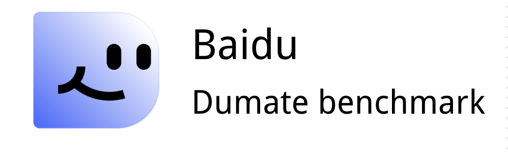

<p align="center">
  
</p>

# DuMateBench

DuMateBench is a Docker-based benchmark for evaluating agents on real-world
productivity and office-work tasks.

Given a task description and a sandboxed workspace, an agent must inspect the
available files and tools, carry out the requested work, and produce the
required artifact. The benchmark then runs a task-specific evaluator and
reports whether the artifact satisfies the task's checks.

The benchmark is designed to evaluate more than command generation. Tasks may
require an agent to work with documents, spreadsheets, presentations, PDFs,
OCR, calendars, web references, and unreliable tools or network conditions.
Evaluation captures the final artifact, execution logs, step count, and reward
details.

This repository contains the evaluation framework, a command-line harness, and
development task datasets. The full benchmark dataset is distributed
separately and is intentionally not committed here.

## Repository layout

| Path | Description |
|------|-------------|
| [`dumatebench/`](dumatebench/) | Core benchmark framework, task runners, evaluators, agent contracts, and example tasks |
| [`dumatebench_cli/`](dumatebench_cli/) | The `dumate` CLI for running an agent against one task or a batch of tasks |
| [`dumatebench/datasets/dev/`](dumatebench/datasets/dev/) | Development and smoke-test task packages |
| [`dumatebench/scripts/`](dumatebench/scripts/) | Batch runners, smoke-test scripts, and evaluation utilities |
| [`dumatebench/agents/`](dumatebench/agents/) | Agent adapter contract and example agents |
| [`.github/workflows/`](.github/workflows/) | Automated code and submission checks |
| [`leaderboard/`](leaderboard/) | Submission intake and CI validation logic |
| [`submissions/`](submissions/) | Pull-request Harbor job manifests and local evidence bundles |

The complete `final_dataset_clean/` data is raw benchmark material and is not
included in this repository. CI uses the checked-in development tasks for
lightweight tests; official score verification will use the canonical dataset
reference and uploaded Harbor trials.

Each runnable task is self-contained. A typical task package looks like:

```text
task/
├── instruction.md              # Task goal and required artifact
├── task.yaml                   # Task metadata and runner configuration
├── workspace_seed/             # Initial files copied into /workspace
├── environment/                # Dockerfile, Compose file, setup, and wrappers
├── evaluator/                  # Checks and evaluator implementation
├── network_faults.yaml         # Optional network fault configuration
├── tool_faults.yaml            # Optional tool fault configuration
├── run_outputs/                # Generated artifacts and reward.json
└── run_logs/                   # Generated execution logs
```

## Quick start

The fastest way to verify the local installation is to run the bundled smoke
task with the example echo agent.

### Prerequisites

You need:

- Python 3.10 or newer; Python 3.12 is recommended
- Docker
- Docker Compose v2, available as `docker compose`

From the repository root:

```bash
cd /path/to/dumate_bench

python3 -m venv .venv
source .venv/bin/activate

python3 -m pip install -r dumatebench/requirements.txt
python3 -m pip install -e dumatebench_cli/
```

Verify the CLI and Docker:

```bash
dumate --help
docker compose version
```

### Run the smoke task

```bash
dumate run \
  --task dumatebench/datasets/dev/odyssey_2_12_smoke \
  --agent 'python3 dumatebench/agents/examples/echo_agent.py' \
  --max-steps 3
```

The smoke task builds a local Docker image, starts the task environment, drives
the adapter for up to three steps, and runs the evaluator. A deterministic
environment-only smoke test is also available:

```bash
bash dumatebench/scripts/run_odyssey_2_12_smoke.sh
```

## Setup details

### Host dependencies

The Python dependencies used by the framework and evaluators are listed in
[`dumatebench/requirements.txt`](dumatebench/requirements.txt). They include
support for Office files, PDFs, images, calendars, YAML, and model-backed
evaluators.

Some optional evaluators require host tools in addition to Python packages:

```bash
# macOS
brew install ffmpeg
brew install libreoffice poppler
```

`ffmpeg` and `ffprobe` are needed by video judge workflows. LibreOffice
(`soffice`) and Poppler (`pdftoppm`) are needed when rendering presentation or
PDF artifacts for evaluation.

### Docker task environment

Tasks are built and run locally; task images are not pulled from a registry.
The default smoke-task base image is `python:3.12-slim`. The task Dockerfile
installs the common command-line tools needed by the sandbox, while task
specific dependencies may intentionally need to be installed by the agent at
runtime.

The task container normally exposes:

```text
/workspace   Initial workspace and agent working directory
/outputs     Final artifacts, mapped to task-local run_outputs/
/logs        Execution logs, mapped to task-local run_logs/
```

The task's `environment/` directory also defines any benchmark tools, wrappers,
and fault injection used by that task. Agents should use the command names
exposed through `PATH` and should not modify benchmark configuration or
evaluator files.

If Docker cannot reach the default Debian mirrors, the base image and apt
mirrors can be overridden for the smoke script:

```bash
DUMATE_BASE_IMAGE=your-mirror/python:3.12-slim \
DUMATE_APT_DEBIAN_MIRROR=http://mirrors.aliyun.com/debian \
DUMATE_APT_SECURITY_MIRROR=http://mirrors.aliyun.com/debian-security \
bash dumatebench/scripts/run_odyssey_2_12_smoke.sh
```

## Usage

### Discover tasks

List task directories that the CLI can run:

```bash
dumate datasets list dumatebench/datasets/dev
```

The CLI discovers directories containing the task markers `task.yaml` and
`instruction.md`.

### Run one task with your own agent

Your agent can be any executable command that implements the
[agent protocol](dumatebench/agents/agent_contract.md):

```bash
dumate run \
  --task /absolute/path/to/task \
  --agent 'python3 /absolute/path/to/my_agent.py' \
  --max-steps 20 \
  --adapter-timeout 180
```

Useful options include:

```text
--max-steps N               Maximum agent steps for each task (default: 20)
--adapter-timeout SECONDS   Timeout for each adapter invocation (default: 180)
--no-build                  Reuse an already-built Docker image
--keep-containers           Keep containers running for debugging
```

### Run a batch

Run multiple tasks concurrently:

```bash
dumate run \
  --dataset dumatebench/datasets/dev \
  --agent 'python3 /absolute/path/to/my_agent.py' \
  --task-glob '*' \
  --limit 5 \
  --concurrency 2
```

The batch command writes a JSON Lines summary under the dataset directory:

```text
batch_summary.<run-id>.jsonl
```

Each record contains the task status, number of steps, evaluator return code,
duration, error information, and the path to that task's
`run_outputs/reward.json`.

Stop a batch after the first task error:

```bash
dumate run \
  --dataset dumatebench/datasets/dev \
  --agent 'python3 /absolute/path/to/my_agent.py' \
  --stop-on-failure
```

Run `dumate run --help`, `dumate datasets --help`, or
`dumate package --help` for the complete option list.

## Agent protocol

The adapter is invoked once per step. It reads exactly one JSON state object
from standard input and writes exactly one JSON action object to standard
output.

Input:

```json
{
  "schema_version": "0.1",
  "step": 1,
  "max_steps": 20,
  "instruction": "Task instruction text",
  "system_prompt": "Environment and tool rules",
  "history": [],
  "last_observation": null
}
```

To request a command in the task container:

```json
{
  "command": "ls -la /workspace",
  "reason": "Inspect the initial workspace"
}
```

To finish:

```json
{
  "finish": true,
  "reason": "The required artifact has been written to /outputs"
}
```

The adapter decides what to do; the runner executes the command inside the
container as the `agent` user with `/workspace` as the working directory.
Before returning `finish: true`, the adapter should verify that the required
artifact exists at the path specified by the task.

See [`dumatebench/agents/agent_contract.md`](dumatebench/agents/agent_contract.md)
for the complete contract and
[`dumatebench/agents/examples/echo_agent.py`](dumatebench/agents/examples/echo_agent.py)
for a minimal implementation.

## Task authoring and validation

Before running or sharing a task package, check its required files and Docker
build context:

```bash
dumate package check /absolute/path/to/task
```

The check verifies the presence of `task.yaml`, `instruction.md`,
`environment/`, and `evaluator/`. It also warns when evaluator or
`web_reference/` gold-reference files may be copied into the task image.

When evaluating an agent, do not modify the task definition, fault
configuration, environment, evaluator, or seeded workspace:

```text
instruction.md
task.yaml
network_faults.yaml
tool_faults.yaml
environment/*
evaluator/*
workspace_seed/*
```

## Results and evaluation

Task-specific evaluators write their result to:

```text
<task>/run_outputs/reward.json
```

Depending on the task, the reward may include complete-pass and partial-pass
scores together with the result of each check. Logs and intermediate artifacts
are kept in `run_logs/` and `run_outputs/` for debugging and analysis.

For lower-level environment details, including workspace initialization,
Docker Compose mounts, tool wrappers, and fault injection, see
[`dumatebench/docker_environment.md`](dumatebench/docker_environment.md).

## Submission bundles

After a batch run, package the generated rewards and logs for submission:

```bash
dumate submission pack \
  --summary dumatebench/datasets/dev/batch_summary.<run-id>.jsonl \
  --out /absolute/path/to/submission \
  --agent-name my-agent \
  --agent-org my-organization \
  --model-name my-model \
  --model-provider openai
```

Validate the bundle before sharing it:

```bash
dumate submission check /absolute/path/to/submission
```

The bundle records run metadata and task results for local evidence. The formal
PR submission is a small manifest containing the Harbor job ID:

```text
submissions/dumatebench/<version>/<agent>__<model>.json
```

```json
{
  "schema_version": 1,
  "harbor_job_id": "job-12345678"
}
```

Then create a branch in your fork and open a pull request to this repository's
`main` branch. A pull request is a reviewable request to add this result record;
it does not require changing the benchmark code. GitHub Actions checks the
manifest using trusted code from the base branch, fetches the real job from
Harbor, verifies the canonical dataset revision and task digests, and computes
DuMateBench's `complete_pass`/`partial_pass` summary from Harbor's verifier
results. If the run includes DuMateBench's LLM-judge fields, CI also recomputes
and checks `final_score`. It rejects claimed scores and copied local results.

When the source job passes, CI creates a leaderboard-owned Harbor snapshot and
opens a bot PR containing that verified snapshot. Maintainers review and merge
the bot PR; the original intake PR is closed. Configure the repository's
`HARBOR_API_KEY` Actions secret and the canonical dataset variables described
in [`leaderboard/README.md`](leaderboard/README.md) before accepting
submissions.

## License

See [`LICENSE`](LICENSE) for the license applicable to this repository.
